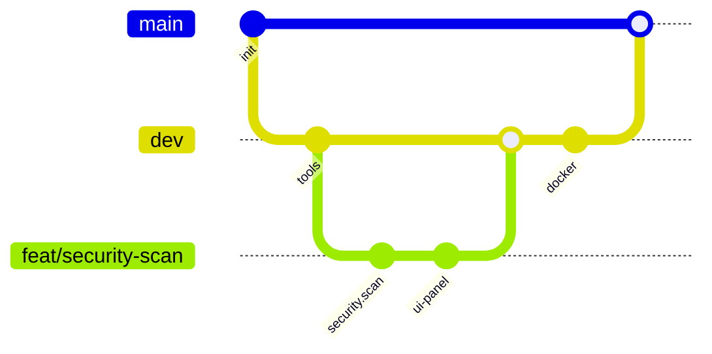

<div align="center">

<!-- Hero Section -->
<picture>
  <source media="(prefers-color-scheme: dark)" srcset="https://capsule-render.vercel.app/api?type=waving&color=gradient&customColorList=6,11,20&height=300&section=header&text=WDTK&fontSize=90&fontAlignY=35&desc=Web%20Developer%20Tools%20Kits%20(CLI%20%2B%20Service%20%2B%20Web%20UI%20%2B%20Desktop)&descAlignY=55&descSize=25&animation=twinkling">
  
</picture>

<p align="center">
  
</p>

<!-- Badges -->
<p align="center">
  <a href="#-license">
    
  </a>
  <a href="#-project-status">
    
  </a>
  <a href="#-docker-build--run">
    
  </a>
  <a href="#-contributing">
    
  </a>
</p>

<!-- Technology Badges -->
<p align="center">
  
  
  
  
  
  
  
</p>

<!-- Navigation -->
<p align="center">
  <a href="#-overview"><kbd> <br> 🎯 Overview <br> </kbd></a>
  <a href="#-architecture"><kbd> <br> 🏗️ Architecture <br> </kbd></a>
  <a href="#-tools"><kbd> <br> 🧰 Tools <br> </kbd></a>
  <a href="#-data--storage"><kbd> <br> 💾 Data <br> </kbd></a>
  <a href="#-docker-build--run"><kbd> <br> 🐳 Docker <br> </kbd></a>
  <a href="#-security"><kbd> <br> 🛡️ Security <br> </kbd></a>
  <a href="#-project-owner"><kbd> <br> 👩‍💻 Owner <br> </kbd></a>
</p>


</div>

<br>

<details open>
<summary><h2>📋 Table of Contents</h2></summary>

- [🎯 Overview](#-overview)
  - [🚀 What is WDTK?](#-what-is-wdtk)
  - [🎯 Perfect For](#-perfect-for)
  - [🏆 Key Highlights](#-key-highlights)
  - [🪄 Virtual Style Effect](#-virtual-style-effect)
  - [📌 Project Status](#-project-status)
- [🏗️ Architecture](#-architecture)
  - [📐 Monorepo Layout](#-monorepo-layout)
  - [🔄 Tool Execution Flow](#-tool-execution-flow)
- [🧩 Interfaces](#-interfaces)
- [🖥️ Web UI](#-web-ui)
- [🧰 Tools](#-tools)
  - [🧰 Utility tool pack](#-utility-tool-pack)
  - [🤖 AI / LLM tools](#-ai--llm-tools)
  - [🧪 Cyber codecs](#-cyber-codecs)
  - [🛡️ Security scan](#-security-scan)
- [🔌 Plugins](#-plugins)
- [💾 Data \& Storage](#-data--storage)
  - [🗄️ SQLite database](#-sqlite-database)
  - [🧩 Plugins storage](#-plugins-storage)
  - [☁️ Optional sync](#-optional-sync)
- [🚀 Quick Start](#-quick-start)
- [🐳 Docker (build + run)](#-docker-build--run)
- [🧪 Security Scan Usage](#-security-scan-usage)
- [🤖 Local LLM Services](#-local-llm-services)
- [🧰 Scripts](#-scripts)
- [🛡️ Security](#-security)
- [🧭 Git Style](#-git-style)
- [🌿 Git Graph](#-git-graph)
- [👩‍💻 Project Owner](#-project-owner)
- [🤝 Contributing](#-contributing)
- [📝 License](#-license)

</details>

<br>

## 🎯 Overview

### 🚀 What is WDTK?

**WDTK (Web Developer Tools Kits)** is a local-first developer toolkit implemented once and exposed consistently through:

- **CLI**
- **Local Service API** (Express on `3001`)
- **Web UI** (React + Vite on `3000`)
- **Desktop app** (Electron embedding the Web UI)

The core tooling logic lives in shared packages so all interfaces execute the same tool implementations.

### 🎯 Perfect For

- Local-first developer workflows
- Quick security checks + JSON output tooling
- Tool-driven automation (CLI/API/UI)
- On-device LLM workflows (Ollama / OpenAI-compatible)

### 🏆 Key Highlights

- Tool registry shared by CLI + Service + Web + Desktop
- Code-editor-style dashboard UI (dark theme + monospace)
- Safe file operations and JSON-first results
- Extensible via plugins installed to `~/.webdevkit/plugins/<pluginId>`

<br>

## 🪄 Virtual Style Effect

The WDTK dashboard UI is designed to feel like a **virtual code editor**:

- Dark theme, monospace typography
- Panel cards for tools
- Editor-like inputs and results

<br>

## 📌 Project Status

- **Status**: Active
- **Web UI**: `http://127.0.0.1:3000`
- **Service API**: `http://127.0.0.1:3001`

<br>

## 🏗️ Architecture

### 📐 Monorepo Layout

```text
WDTK/
  apps/
    cli/        # CLI interface
    service/    # local API on :3001
    web/        # dashboard on :3000
    desktop/    # Electron wrapper
  packages/
    core/       # shared project utils
    db/         # SQLite data layer
    sync/       # sync primitives
    tools/      # tool registry + implementations
    plugins/    # plugin loader + storage
```

### 🔄 Tool Execution Flow

```text
Web UI / Desktop / CLI
  -> Service API (/api/tools/run)
    -> @webdevkit/tools registry
      -> tool implementation
        -> JSON result
```

Note: the internal package scope (`@webdevkit/*`) and some env vars/data paths still use the `webdevkit` prefix.

<br>

## 🧩 Interfaces

- **CLI**: run tools from the terminal
- **Service API**: `POST /api/tools/run`
- **Web UI**: interactive dashboard
- **Desktop**: Electron wrapper for the Web UI

<br>

## 🖥️ Web UI

Common panels include:

- File Search / File Tree
- HTTP Request / Hash
- Code Editor (JSON validate/pretty/minify + file load)
- VM Runner (`vm.eval`)
- Online OS Info (`os.info`)
- Security Scan (`security.scan`)

<br>

## 🧰 Tools

Examples:

- `project.context`
- `fs.search`, `fs.tree`
- `http.request`, `hash.compute`
- `os.info`, `vm.eval`
- `security.scan`
- `cyber.codec`
- `ai.models`, `ai.chat`, `ai.codegen`, `ai.files.write`

### 🧰 Utility tool pack

Extra `util.*` utilities (JSON/text/fs/url/random/math helpers).

### 🤖 AI / LLM tools

- `ai.models`
- `ai.chat`
- `ai.codegen`
- `ai.files.write`

### 🧪 Cyber codecs

- `cyber.codec`

### 🛡️ Security scan

- `security.scan`

<br>

## 🔌 Plugins

- Install dir: `~/.webdevkit/plugins/<pluginId>`
- Management tool: `plugins.manage`

<br>

## 💾 Data & Storage

WDTK is **local-first**. By default, it stores user data under:

- `~/.webdevkit/`

Note: even though the project name is **WDTK**, the current on-disk folder/env var prefix is `webdevkit` (e.g. `WEBDEVKIT_DB_PATH`).

### 🗄️ SQLite database

The default DB file is:

- `~/.webdevkit/webdevkit.sqlite`

You can override it with:

- `WEBDEVKIT_DB_PATH=/absolute/path/to/webdevkit.sqlite`

Implementation notes:

- SQLite uses WAL mode for better concurrency.

### 🧩 Plugins storage

Plugins are stored under:

- `~/.webdevkit/plugins/`

### ☁️ Optional sync

If configured, some user data (e.g. preferences/snippets) can be synced via Supabase tools (`supabase.*`).

<br>

## 🚀 Quick Start

```bash
npm install

# Run everything (web + service + desktop)
npm run dev
```

Verify the service:

```bash
curl -sS http://127.0.0.1:3001/health
```

Run a sample tool:

```bash
curl -sS -X POST http://127.0.0.1:3001/api/tools/run \
  -H 'content-type: application/json' \
  -d '{"name":"project.context","params":{},"context":{"cwd":"."}}'
```

Open:

- Web UI: `http://127.0.0.1:3000`
- Service API: `http://127.0.0.1:3001`

Run tests:

```bash
npm test
npm run lint
npm run security:test
```

<br>

## 🐳 Docker (build + run)

```bash
docker compose up --build
```

<br>

## 🧪 Security Scan Usage

```bash
curl -sS -X POST http://127.0.0.1:3001/api/tools/run \
  -H 'content-type: application/json' \
  -d '{"name":"security.scan","params":{"maxFindings":200},"context":{"cwd":"."}}'
```

<br>

## 🤖 Local LLM Services

WDTK supports hosted and local LLMs through `ai.chat`.

Common env vars:

- `WEBDEVKIT_AI_PROVIDER`
- `WEBDEVKIT_AI_BASE_URL`
- `OPENAI_API_KEY` (only required for hosted OpenAI)

<br>

## 🧰 Scripts

- `npm run security:scan` — basic secret pattern scan
- `npm run security:report` — writes a JSON report to `reports/security-report.json`

<br>

## 🛡️ Security

- See `SECURITY.txt`

Best practices:

- Do not commit secrets
- Prefer environment variables
- Keep plugins local and validate manifests

<br>

## 🧭 Git Style

- `main`: stable
- `dev`: integration
- `feat/<topic>`: features
- `fix/<topic>`: bug fixes
- `chore/<topic>`: refactors, tooling, docs

<br>

## 🌿 Git Graph



<br>

## 👩‍💻 Project Owner

- **Owner**: Lily Yang
- **Email**: lily0yangroot@gmail.com
- **GitHub**: https://github.com/lily0ang

<br>

## 🤝 Contributing

- See `CONTRIBUTING.txt`

<br>

## 📝 License

This repo does not currently include a `LICENSE` file. Add one if you want an explicit license badge/link.

<br>

<div align="center">


</div>
